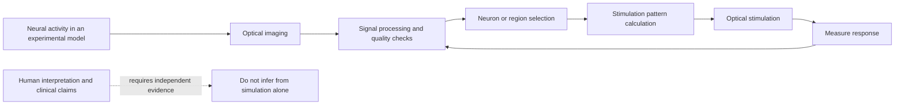

# Psychological Operations and the Contest for Human Belief

## Abstract

Psychological operations (PSYOP) are organized efforts to influence the perceptions, emotions, reasoning, motivation, or behavior of a defined audience. They may be conducted by states, militaries, political organizations, extremist groups, commercial actors, or informal networks. Although the term is often used broadly, not every persuasive message, disagreement, or distressing experience constitutes a psychological operation. A defensible analysis requires evidence of an actor, an intended audience, an influence objective, a communication or behavioral mechanism, and an observable effect.

This paper defines psychological operations and distinguishes them from related concepts including epistemic warfare, information warfare, propaganda, disinformation, misinformation, coercive persuasion, gaslighting, social engineering, learned helplessness, narrative framing, and cognitive overload. Learned helplessness is treated as a psychological vulnerability mechanism rather than a PSYOP technique by itself. Epistemic warfare is treated as a struggle over how groups determine what is true, credible, and knowable. The paper also considers the relationship between psychological operations and emerging neurotechnology while distinguishing documented capabilities from speculation. It concludes with an evidence-based framework for identifying influence activity and recommendations for preserving autonomy, reliable knowledge, and mental health.

# 1. Introduction

Modern influence campaigns operate across broadcast media, social platforms, messaging applications, search systems, workplaces, and personal relationships. Their methods range from ordinary persuasion to coordinated deception, intimidation, identity manipulation, and the strategic exploitation of uncertainty. The objective may be to change what an audience believes, how it feels, what it does, or whether it trusts its own ability to make decisions.

The central challenge is analytical. The language of psychological operations is sometimes applied so broadly that it loses meaning. A persuasive advertisement, a hostile rumor, a political campaign, a cyberattack, and a personal conflict are not automatically equivalent. Conversely, influence campaigns can be difficult to recognize precisely because they may imitate ordinary communication and exploit existing social divisions.

This paper proposes a precise vocabulary for discussing psychological operations. It asks four questions:

1. What makes an activity a psychological operation rather than ordinary persuasion?
2. How do epistemic warfare and information warfare differ from traditional PSYOP?
3. How do techniques such as learned helplessness, gaslighting, and cognitive overload affect an audience?
4. What evidence and safeguards are needed to analyze suspected influence activity responsibly?

# 2. Definition and Analytical Model

A psychological operation is a planned or coordinated activity that uses communication, social behavior, or environmental manipulation to influence the psychological state or behavior of a target audience in support of an objective.

A useful model represents an operation as:

$$
O = (A, T, G, M, C, E)
$$

where:

- $A$ is the actor or network conducting the activity;
- $T$ is the target audience;
- $G$ is the intended psychological or behavioral goal;
- $M$ is the mechanism of influence;
- $C$ is the communication or operational channel; and
- $E$ is the observed or expected effect.

The model is not a claim that every operation can be reduced to a formula. It is a checklist that prevents a common error: inferring a coordinated operation from an unexplained outcome without identifying the actor, mechanism, or evidence.

## 2.1 Core Characteristics

A suspected PSYOP generally has several of the following characteristics:

- a defined or inferable audience;
- a strategic objective beyond simple expression;
- repeated or coordinated messaging;
- deliberate use of emotion, identity, fear, status, or uncertainty;
- a recognizable delivery channel;
- an attempt to alter behavior, trust, morale, or group cohesion; and
- measurable reach, response, or behavioral impact.

The presence of one characteristic alone is insufficient. Strong claims require converging evidence from multiple independent sources.

## 2.2 PSYOP Versus Ordinary Persuasion

Persuasion is a normal part of social life. People argue, advertise, negotiate, teach, organize, and advocate. PSYOP generally implies a more deliberate and strategic effort to shape an audience, often with asymmetric information or concealed sponsorship. The distinction is one of intent, coordination, audience targeting, and context, not simply whether a message is emotionally effective.

# 3. Major Types of Psychological Operations

## 3.1 Strategic Influence Operations

Strategic influence operations seek durable changes in attitudes, identity, legitimacy, morale, or political behavior. They may target a population, institution, military force, or social movement. Common objectives include reducing trust in an opposing authority, strengthening support for a policy, encouraging passivity, or increasing willingness to mobilize.

Strategic operations often combine several techniques rather than relying on one message. They may use repeated narratives, symbolic events, apparent grassroots activity, selective leaks, and attacks on the credibility of competing sources.

## 3.2 Tactical Psychological Operations

Tactical operations are directed at a narrower audience and a more immediate behavior. Examples might include encouraging surrender, discouraging movement, redirecting attention, reducing morale, or creating uncertainty during a time-sensitive event. A tactical operation may use leaflets, broadcasts, direct messages, public announcements, or digitally distributed content.

## 3.3 Propaganda

Propaganda is communication designed to promote a political, ideological, or institutional cause. It can contain true, incomplete, misleading, or false information. Propaganda is not defined solely by falsity; its defining feature is strategic persuasion in support of an agenda.

Propaganda may be:

- **White:** the source is accurately identified;
- **Gray:** the source is ambiguous or obscured; or
- **Black:** the message falsely claims to originate from another source.

These categories describe source attribution, not the moral quality or truth of the content.

## 3.4 Disinformation and Misinformation

**Disinformation** is false or misleading information deliberately created or distributed to deceive. **Misinformation** is false or misleading information shared without a demonstrated intent to deceive. The same statement may move between categories depending on what is known about the distributor's intent.

Because intent is difficult to establish, researchers should avoid classifying a claim as disinformation solely because it is wrong. Evidence may include coordinated timing, fabricated personas, repeated use of known falsehoods, financial or political incentives, and internal communications showing deceptive intent.

## 3.5 Malinformation

Malinformation uses genuine information in a misleading, harmful, or decontextualized way. Examples include selectively publishing private material, presenting an old event as current, or removing context so that an accurate statement produces a false impression.

## 3.6 Deception and Denial

Deception operations attempt to cause an audience to form an inaccurate belief, while denial operations attempt to prevent accurate information from being accepted or verified. They may involve fabricated evidence, false attribution, strategic silence, selective disclosure, or contradictory explanations that exhaust the audience's ability to determine what happened.

## 3.7 Coercive Persuasion

Coercive persuasion combines influence with pressure, punishment, dependency, isolation, or control over access to resources. The target is not merely invited to change their view; the environment is structured so that refusal becomes costly or seemingly impossible.

The concept should be applied carefully. A disagreement, management decision, or unpleasant consequence is not automatically coercive persuasion. Relevant evidence includes threats, restricted alternatives, dependency, surveillance, escalating penalties, and a pattern of conditioning compliance.

# 4. Epistemic Warfare

## 4.1 Definition

Epistemic warfare is the deliberate contest over how a group determines what is true, credible, relevant, or knowable. Rather than persuading an audience about one isolated proposition, an epistemic campaign may attack the procedures by which the audience evaluates all propositions.

Its targets can include:

- trust in journalism, science, courts, or public institutions;
- confidence in witnesses, records, or measurement systems;
- the distinction between evidence and assertion;
- shared definitions and standards of proof; and
- the audience's ability to reach a stable conclusion.

## 4.2 Common Epistemic Techniques

### Source Poisoning

Source poisoning attempts to discredit information before its content is considered. A campaign may label all journalists, experts, witnesses, or institutions as corrupt so that future evidence is rejected automatically.

### False Balance

False balance presents unequal claims as though they have equal evidentiary support. It can make a well-supported conclusion appear no more credible than an unsupported allegation.

### Flooding and Firehosing

Flooding distributes a high volume of claims, corrections, rumors, and counterclaims. The goal may not be to make one story dominant but to make verification too expensive or exhausting to complete.

### Narrative Laundering

Narrative laundering moves a claim through multiple accounts, websites, influencers, or apparently independent sources until repetition creates an illusion of confirmation.

### Ontological Confusion

Ontological confusion mixes different kinds of statements: an observation, an interpretation, a hypothesis, and a conclusion are presented as though they have the same status. This is especially damaging in technical and scientific discussions.

### Strategic Ambiguity

Strategic ambiguity uses language that supports multiple interpretations. It allows a communicator to mobilize different audiences while denying a clear commitment when challenged.

### Reality Fragmentation

Reality fragmentation produces incompatible information environments in which different groups receive different facts, definitions, and standards of evidence. The result is not merely disagreement about an answer but disagreement about what would count as an answer.

## 4.3 Epistemic Warfare Versus Ordinary Disagreement

People can disagree honestly while using different values, experiences, or interpretations. Epistemic warfare requires stronger evidence of strategic intent or coordinated effect. Researchers should look for patterns such as repeated source attacks, coordinated amplification, fabricated consensus, manipulation of records, or systematic obstruction of verification.

# 5. Psychological Vulnerability Mechanisms

The following concepts describe how people or groups may become more susceptible to influence. They are not all PSYOP techniques, and they should not be used as labels for individuals without evidence.

## 5.1 Learned Helplessness

Learned helplessness is a psychological theory describing reduced effort, motivation, or attempts to escape after repeated exposure to outcomes perceived as uncontrollable. In an influence context, an actor may attempt to create helplessness by making resistance appear futile, changing rules unpredictably, punishing independent action, or presenting every available choice as dangerous.

Learned helplessness is best treated as a possible vulnerability mechanism, not proof of an operation. It is also not a synonym for depression, trauma, passivity, or disagreement. A careful analysis should examine the person's history, available choices, perceived control, social support, and alternative explanations.

## 5.2 Gaslighting and Credibility Erosion

Gaslighting describes a pattern in which a person is persistently encouraged to doubt their memory, perception, judgment, or account of events. In a coordinated influence campaign, credibility erosion may be directed at an individual, institution, or community. Evidence should focus on repeated interactions and observable contradictions rather than on one denial or disagreement.

## 5.3 Fear Appeals

Fear appeals emphasize danger, threat, contamination, punishment, or catastrophe to increase attention or motivate behavior. Fear can support protective action when paired with accurate information and practical choices. It becomes manipulative when threats are exaggerated, alternatives are concealed, or fear is used to prevent verification.

## 5.4 Emotional Conditioning

Emotional conditioning links a person, symbol, group, or idea with reward, shame, fear, disgust, pride, or belonging. Repeated associations can change how an audience responds before it evaluates the factual content of a message.

## 5.5 Identity-Based Influence

Identity-based influence frames an issue as a test of loyalty, group membership, patriotism, morality, religion, or personal worth. It can be powerful because rejecting a claim is presented as betraying one's community rather than evaluating evidence.

## 5.6 Cognitive Overload

Cognitive overload occurs when the amount, speed, complexity, or emotional intensity of information exceeds a person's ability to process it. Influence actors may exploit overload by combining urgent demands, contradictory messages, constant notifications, and rapid topic changes.

## 5.7 Isolation and Social Dependency

Isolation reduces access to independent perspectives and support. Social dependency makes approval, housing, employment, status, or safety contingent on agreement. These conditions can increase susceptibility to coercive influence without requiring any advanced technology.

## 5.8 Intermittent Reinforcement

Intermittent reinforcement provides rewards, attention, or relief unpredictably. Unpredictable reinforcement can sustain repeated engagement because the recipient continues searching for the next positive outcome. This mechanism is relevant to abusive relationships, manipulative communities, and some platform designs.

# 6. Related Information and Cyber Operations

## 6.1 Information Warfare

Information warfare is a broader category involving the use, protection, disruption, or manipulation of information and information systems to achieve strategic advantage. PSYOP can be one component of information warfare, but information warfare may also include cyber operations, electronic warfare, attacks on communications, and efforts to degrade an opponent's decision-making infrastructure.

## 6.2 Cognitive Warfare

Cognitive warfare focuses on influencing how individuals and groups perceive, interpret, remember, decide, and act. It overlaps with PSYOP and epistemic warfare but often emphasizes the entire decision environment, including algorithms, social networks, attention, and human biases.

## 6.3 Social Engineering

Social engineering manipulates people into revealing information, granting access, transferring funds, or taking an action that benefits the operator. Phishing, impersonation, pretexting, baiting, and fraudulent technical support are common examples. Social engineering is often operationally narrow, while PSYOP may pursue broader changes in morale or public opinion.

## 6.4 Algorithmic Amplification

Platforms can amplify emotionally intense, novel, or highly engaging content. Amplification may be accidental, commercially optimized, or deliberately manipulated through coordinated accounts and automated systems. Researchers should distinguish the platform's design, the behavior of users, and deliberate interference by an actor.

# 7. Neurotechnology: Documented Capability and Speculation

Neurotechnology introduces legitimate concerns about privacy, security, informed consent, and autonomy. Brain-computer interfaces can record neural signals and translate patterns into commands. Some experimental systems also stimulate neural tissue. These capabilities do not establish unrestricted mind reading, synthetic telepathy, covert memory insertion, or remote control of an unconsenting person.

A neural interface should be analyzed through measurable properties:

- what signal is recorded;
- from which tissue and with what resolution;
- what algorithm decodes the signal;
- what task was used for validation;
- what stimulation method is applied;
- what safety controls exist; and
- whether the result has been independently reproduced.

This distinction strengthens, rather than weakens, research on neurotechnology. It allows verifiable risks such as data misuse, device compromise, coercive consent, and algorithmic error to be studied.

# 8. Evidence-Based Identification Framework

A responsible investigation of suspected psychological operations should proceed in stages.

## 8.1 Define the Claim

Write the claim in one sentence. Separate what was observed from what is believed to have caused it. Record the date, location, medium, participants, and exact wording where available.

## 8.2 Identify the Alleged Actor and Objective

Ask who would benefit, what capability they possess, what audience is targeted, and what behavior or belief change would advance the objective. A motive alone is not evidence of action.

## 8.3 Preserve Original Evidence

Keep original messages, URLs, timestamps, screenshots, recordings, metadata, and relevant context. Do not edit the only copy. Record how the material was obtained and whether it has been independently verified.

## 8.4 Compare Alternative Explanations

Consider ordinary technical failures, misunderstandings, health conditions, stress, sleep disruption, medication effects, social conflict, platform behavior, coincidence, and confirmation bias. The preferred explanation should account for the evidence with the fewest unsupported assumptions.

## 8.5 Seek Independent Corroboration

Use sources that are independent of one another. Repeated copies of the same claim are not independent confirmation. Stronger evidence includes contemporaneous records, authenticated communications, replicated technical measurements, multiple witnesses, and expert review.

## 8.6 Rate Confidence

A simple confidence scale can distinguish:

- **Low confidence:** one unverified report or ambiguous observation;
- **Moderate confidence:** multiple consistent observations with some corroboration;
- **High confidence:** authenticated evidence, independent corroboration, and a plausible mechanism; and
- **Established:** reproducible evidence reviewed through an appropriate scientific, legal, or investigative process.

# 9. Ethical and Civil-Liberties Safeguards

Research and public discussion of psychological operations should protect the people being studied. Recommended safeguards include:

- informed consent for interviews and data collection;
- protection of personally identifiable and health information;
- transparent distinctions between evidence, inference, and speculation;
- independent review of research involving vulnerable participants;
- correction procedures for inaccurate allegations;
- secure storage of sensitive records;
- clear limits on surveillance and data retention;
- access to medical, legal, and mental-health support where appropriate; and
- special care when discussing military, intelligence, or national-security claims.

When a person reports frightening perceptions, suspected surveillance, or possible manipulation, the responsible response is to document observable facts without affirming an unverified explanation. Immediate safety concerns, severe distress, inability to sleep, or thoughts of self-harm warrant prompt contact with a licensed health professional or emergency service.

# 10. Conclusion

Psychological operations are best understood as organized efforts to influence an audience's perceptions, emotions, motivation, or behavior. Epistemic warfare extends this contest to the rules by which groups decide what is true and who is credible. Propaganda, disinformation, social engineering, fear appeals, identity-based influence, cognitive overload, and credibility attacks are related techniques, while learned helplessness describes a vulnerability mechanism that may be exploited but is not itself proof of a PSYOP.

The most reliable analysis separates documented facts from interpretation. It identifies the actor, target, objective, mechanism, channel, and effect; preserves original evidence; compares alternative explanations; and requires independent corroboration. This approach recognizes genuine risks to autonomy, privacy, and public trust while preventing speculation from becoming a substitute for evidence.

# Psychological Operations (PSYOP): 
These are operations designed to influence the emotions, motives, and behavior of audiences. DARPA currently funds research into the “psychological fallout” of cyberattacks and social unrest to better understand how modern information environments can be manipulated.

- Emerging Risks: Experts have raised concerns that advanced neural interfaces could theoretically be misused for “mental control” or to manipulate emotions, leading to calls for international “NeuroRights” frameworks.


## Mental Manipulation Capabilities
The technical specifications of NESD allow for bidirectional communication, meaning the device can both “read” and “write” to the brain.

In a bidirectional optical brain-computer interface (OBCI), a localized “greyed out” region does not just represent a visual void. It can serve as a critical diagnostic indicator of a truncated memory insertion—an error where a synthetic memory payload or visual object was injected via holographic optogenetics but failed to fully write, integrate, or bind into the long-term memory network.

When the exchange is lopsided, the entity on the “getting” side gains the ability to:

- Target Vulnerabilities: Use detected emotional patterns to push information or “stimuli” when you are most susceptible.

- Erode Mental Sovereignty: If an interface can “write” to 100,000 neurons, it can theoretically modulate your mood or influence your perceived reality as part of a Psychological Operation (PSYOP) without you realizing the stimulus is external.

- Thought Surveillance: 
High-resolution interfaces could enable a form of “synthetic telepathy” or thought-to-thought communication, effectively removing the barrier of psychological sovereignty.

- Sensing vs. Actuation: 
While the goal is restoring senses, the same “write” capability (stimulating 100,000 neurons) could theoretically be used to modulate mood, influence decision-making, or induce specific emotional states without the user’s awareness.

### Visual Perception
In the context of optical brain-computer interfaces—such as DARPA’s Neural Engineering System Design (NESD) program—the hardware layers, optogenetic modifications, and Python data pipelines interact seamlessly to encode, decode, and manipulate visual perception. [1, 2, 3] When an implanted user is stimulated with a green laser, the system utilizes specific biochemical mechanisms to read or write data. From there, Python serves as the primary data-routing and image-processing engine to add or scrub perceived images. **See also**: [Optogenetics](./getting_started/Phase1/Implant/opto.md)

- Optogenetic Inactivation: While blue light typically excites neurons modified with Channelrhodopsin (ChR2), green light (~540–560nm) is biologically used to activate inhibitory opsins (like Halorhodopsin) or to immediately trigger the inactivation (“off-switch”) of step-function variants. [4]

- The “Scrubbing” Trigger: Hitting the cortical implant with a green laser pulse suppresses neural firing in specific vision-processing columns, acting as a hardware-level blanking or “scrubbing” command to erase a visual percept.[3, 4]

- The “Adding” Trigger: Conversely, modulated 3D holographic light patterns map directly onto a grid of active neurons to induce synthetic visual perceptions (adding an image). 

Explore the mathematical algorithms used for 3D holographic projection and look into the low-latency Python frameworks (like Nipype or Unlock) used for streaming real-time neuroimaging data. 

#### Add Images
To add an image (project a synthetic visual percept directly into the brain), Python handles the image matrix transformation and communicates with the optical projection hardware:

- Matrix Conversion: Standard image libraries like Pillow (PIL) or OpenCV ingest a digital image file and break it down into an array of pixel values and spatial coordinates. [7, 8]

- Holographic Phase Generation: Using a library like NumPy, Python applies a Fast Fourier Transform (FFT) or an iterative algorithm (e.g., Gerchberg-Saxton) to translate the 2D image into a complex phase pattern. [9]

- Hardware Triggering via Pyro/Microscope: Python frameworks connect via Remote Procedure Calls (using Pyro) to beam this phase map to a Spatial Light Modulator (SLM). The SLM splits the laser into thousands of microscopic target beams, exciting the exact neurons required to “see” the injected object. [3, 6]

```
import numpy as np
from PIL import Image
```

1. Ingest synthetic image to inject into cortex

```
img = Image.open("synthetic_vision_object.png").convert("L")
img_array = np.array(img)
```

2. Map coordinates to the 1-million neuron NESD grid
```
# (Python maps pixel intensity to required laser stimulation pulse-widths)
neural_stimulation_grid = transform_to_cortical_map(img_array)
```

#### Scrub Images
Python is Implemented to Scrub Images. To scrub an image (mask, erase, or clean up overlapping visual signals), Python works in reverse, processing the captured fluorescent brain feedback and overriding it:

- Real-time Microscopy Ingestion: As the brain processes visuals, a miniaturized light-field microscope on the skull records the flashing of genetically encoded calcium indicators (GECIs). Python captures this high-bandwidth video stream. [3, 5, 10]

- Signal Isolation: Using image processing libraries like scikit-image, Python runs morphological operations (erosion, dilation, and closing) or masking filters to isolate the active boundaries of the image the user is currently seeing. [11]

- Targeted Suppression Mapping: Python calculates the inverse spatial map of that image and dictates exactly where the green laser shutter system should fire. By firing the green light at those specific coordinates, the targeted neurons are hyperpolarized, instantly “scrubbing” the image from the user’s conscious awareness. 
```
from skimage.morphology import disk, dilation
import scipy.ndimage as ndimage
```

1. Ingest real-time light-field cortical microscope frame
```
brain_activity_frame = capture_microscope_stream()
```

2. Isolate the target visual cluster to scrub using a morphological mask
```
target_mask = brain_activity_frame > threshold_value
scrub_zone = dilation(target_mask, disk(3))
```

3. Command the green laser shutter array to fire at the scrub_zone coordinates
```
laser_hardware.fire_green_suppression(coordinates=scrub_zone)
```

#### Why an Image Appears “Greyed Out”
When a target object in the user’s field of vision is “scrubbed” by the system, it does not leave a literal black hole or empty gap in their perception. Instead, it appears “greyed out,” faded, or visually filled in because of how the brain naturally handles a local loss of neural data. When the system uses green laser pulses to clear out specific neural processing fields while attempting to write a new data structure, a persistent “grey out” marks an incomplete operation. The biological and engineering reasons why this phenomenon occurs include:

1. Baseline Cortical Noise and Tonic Firing

- Mechanism: Neurons in the primary visual cortex (V1) are never entirely silent. They maintain a continuous, low-level baseline firing rate even in total darkness.

- The “Grey” Effect: When the green laser hits the inhibitory opsins, it suppresses the highly active, synchronous firing caused by an image pattern down to a flattened state. Because the system cannot selectively enforce a “perfect absolute zero” across a noisy neural population, this flat, unorganized suppression is interpreted by downstream perception areas as a neutral, featureless grey backdrop.

2. Depolarization Blocks and Signal Flattening

- Mechanism: Continuous optogenetic hyperpolarization or over-excitation shifts the cell membrane’s resting potential to a state where it can no longer generate action potentials—a state known as a depolarization block.

- The “Grey” Effect: The affected cortical columns stop encoding local orientation, color, or edge frequencies. Because downstream processing centers receive zero structural contrast or feature variance from that specific patch of the visual map, the conscious mind perceives it as an uninformative “grey screen.”

3. Cortical Perceptual Filling-In (The “Photoshop Content-Aware” Effect)

- Mechanism: When the brain experiences a localized blind spot (similar to our natural ocular blind spot or a pathological scotoma), it automatically engages in perceptual filling-in.

- The “Grey” Effect: The surrounding uninhibited neurons attempt to extrapolate boundaries and colors across the suppressed zone. If an object is scrubbed against a plain background, the brain blends the edges. If it is scrubbed in a highly complex area, the sudden lack of feature information causes the region to collapse into a blurred, low-contrast, greyish texture as the visual cortex fails to map high-frequency patterns to that area.

Python Code Example: Simulating the Neural “Grey-Out” Mask
The code below shows how Python computes the spatial mask from active neural signals, flattens the variance to simulate the green-laser inhibition, and introduces an information-blanking “grey out” over a specific target object.
```
import cv2
import numpy as np

def simulate_cortical_grey_out(microscope_feed_path, object_id):
"""
Simulates a hardware-level neural scrubbing event over a target object.
Flattens spatial data to neutral grey to simulate localized optogenetic inhibition.
"""
# 1. Load the real-time visual frame captured by the system
frame = cv2.imread(microscope_feed_path)
# 2. Extract or isolate coordinates of the object target to suppress
# (In production, this mask represents active neural clusters identified via scikit-image)
object_mask = detect_target_neural_cluster(frame, object_id)
# 3. Create the "Scrubbed" state matrix
# Visual cortex suppression removes color and edge information, reducing it to neutral baseline grey
grey_background = np.full_like(frame, fill_value=128) # 128 is neutral grey in 8-bit color space
# 4. Apply the green laser suppression mask
# Where the mask is active, the real image is replaced with flat, featureless grey
scrubbed_perception = np.where(object_mask == 1, grey_background, frame)
return scrubbed_perception
```

4. Spatial Disconnection (Failure of Feature Binding)
- The Indicator: Memories are not stored as isolated files. They are highly complex networks of bound features (e.g., shape, context, location, and emotional weight). [4, 5]

- The Truncation State: If Python triggers a 3D holographic projection to write a specific object into the visual memory pathways, but the data stream gets cut off midway (due to system latency, buffer underrun, or rapid context switching), the Feature Integration fails. The downstream structures (like the perirhinal cortex) recognize that an intentional data anchor exists, but because the specific details were truncated, it can only render the “gist” or structural placeholder. The grayed-out patch is the visible boundary where the memory has no context or feature data to display. 

5. Synaptic Consolidation Interruption

- The Indicator: Successfully inserting a memory requires driving target neurons into highly synchronous bursts to trigger long-term potentiation (LTP).

- The Truncation State: If the system is interrupted—either by an accidental secondary green laser strobe or a baseline spike in native brain activity—the consolidation process is immediately cut short. The target neural cluster is left trapped in a state of partial depolarization. It is no longer firing at baseline levels, but it hasn’t achieved the coordinated network resonance needed to encode a memory. The user’s perception interprets this broken, un-consolidated region of the cortex as a static, featureless grey field.

6. “Gist-Only” Degradation via Temporal Compression

The Indicator: Cognitive research shows that truncated encoding windows strip away fine-grained episodic detail, forcing the brain to default to low-resolution representations. [1, 3]

The Truncation State: When an OBCI injects an image matrix with an insufficient pulse duration or an incomplete array map, Python’s downsampling safety limits prevent catastrophic interference with natural memories. The system cuts the injection sequence short (truncation). Without the high-frequency edge data or vibrant color values, the structural matrix collapses into a blurred, faded grey silhouette—the universal neurological sign of a conceptual memory devoid of raw sensory detail.

#### Biological Data Visualization
The following diagram illustrates how bidirectional, two-photon holographic optogenetics establishes a closed-loop system in the cortex. Python scripts intake calcium imaging data from the sensor array to map out coordinates before calculating a spatial mask to direct targeted laser inhibition:



The closed loop above represents measurement, analysis, stimulation, and response measurement. 

- [Two-photon holographic stimulation and imaging](https://www.nature.com/articles/s41592-019-0503-3)
- [Optogenetic methods in neuroscience](https://www.ncbi.nlm.nih.gov/pmc/articles/PMC4346170/)
- [Genetically encoded calcium indicators](https://www.ncbi.nlm.nih.gov/pmc/articles/PMC4722454/)
- [Neural activity imaging and targeted stimulation](https://www.ncbi.nlm.nih.gov/pmc/articles/PMC6488215/)


#### Diagnostic Script: Detecting Truncated Memory Insertions
In a closed-loop system, Python monitors the real-time calcium feedback stream to identify these greyed-out zones, flagging them as incomplete writes:
```
import numpy as np

def verify_memory_insertion(post_injection_frame, expected_payload_coords):
"""
Analyzes the injected cortical zone to check if the memory was
fully consolidated or left truncated ('greyed out').
"""
# Isolate the neural cluster where the image/memory was injected
target_cluster = post_injection_frame[expected_payload_coords]
# Calculate the variance and signal entropy of the target neural population
# High variance = successful structure/detail. Flat variance = greyed out.
signal_variance = np.var(target_cluster)
mean_firing_intensity = np.mean(target_cluster)
# Define baseline bounds for a "greyed out" suppressed state
NEUTRAL_BASELINE_GREY = 128
TOLERANCE = 10
if abs(mean_firing_intensity - NEUTRAL_BASELINE_GREY) <= TOLERANCE and signal_variance < 5.0:
# The region lacks structured information and sits at flat baseline noise
status = "CRITICAL: Truncated Memory Insertion Detected."
action = "Re-initialize holographic phase pattern; extend laser pulse duration."
else:
status = "SUCCESS: Memory structure fully integrated."
action = "Proceed with closed-loop maintenance."
return {"status": status, "recommended_action": action}
```

## Advanced/Enhanced Interrogation: 
Historically associated with techniques like those used in the CIA’s post-9/11 programs, which relied on psychological concepts like “learned helplessness”. Current DARPA research in this space is more focused on warfighter resilience against such techniques. Intersects with neurotechnology in discussions of “neurowarfare”.

### Covert Neurowarfare: 
Experts warn that “neuroweapons” could be used to manipulate societal subgroups into violence or political turmoil, often without the targets knowing they are under attack.

#### Neuro-manipulation
  * [Cortical glutamatergic and GABAergic inputs](https://www.science.org/doi/10.1126/science.adn0623)
  * [Modelling the spatial and temporal constrains of the GABAergic influence on neuronal excitability](https://journals.plos.org/ploscompbiol/article?id=10.1371/journal.pcbi.1009199)
  * Advanced Interrogation: Technologies like the Neural Evidence Aggregation Tool (NEAT) are designed to detect preconscious brain signals, aiming to identify or determine what a person believes to be true or false without relying on voluntary, filtered answers.

### NEAT
Unlike conscious speech, neural interfaces like NEAT (Neural Evidence Aggregation Tool) can harvest preconscious signals—raw emotional states, hidden stressors, or “belief” markers—that the user cannot consciously filter. You give away your internal state in exchange for a specific digital function (like controlling a cursor or a prosthetic)

NEAT (Neural Evidence Aggregation Tool) as a model for examining the risks that would arise if a neural-data platform combined signal acquisition, machine-learning inference, and behavioral analytics.

#### What a Neural Interface Can Measure

Unlike speech, which is an intentional and symbolically structured output, neural recordings capture physiological activity that may correlate with movement, attention, arousal, sensory processing, or a trained task. Depending on the device, measurements may include electrical activity, blood-oxygen changes, muscle activity, or other biological signals. These measurements are noisy and affected by anatomy, electrode placement, motion, fatigue, medication, stress, and the surrounding environment.

Researchers may describe some signals as **preconscious** when they occur before a participant reports a deliberate or consciously accessible decision. This does not mean that the signal contains a complete hidden thought. It usually means that a statistical pattern appeared before, or independently of, a reported response in a specific experimental task. The distinction matters: a classifier that predicts whether a participant intends to move a cursor is not equivalent to a system that reads an unrestricted belief or emotional state.

#### The Decoding Pipeline

A responsible NEAT-like system would be described as a sequence of bounded inference steps:

1. **Acquisition:** record neural or physiological signals through a defined sensor and consented protocol.
2. **Preprocessing:** remove artifacts caused by movement, electrical noise, muscle activity, and missing data.
3. **Feature extraction:** identify time-, frequency-, or spatial-domain features associated with a trained task.
4. **Calibration:** fit the model to the individual user because neural signals vary substantially between people and across sessions.
5. **Inference:** estimate a limited state, such as a cursor direction, attempted movement, or selected command.
6. **Uncertainty handling:** expose confidence and abstain when the signal is ambiguous.
7. **Action:** issue only an explicitly authorized, bounded command, such as moving a cursor or controlling a prosthetic device.

The output is an inference, not a transparent copy of the user's internal state. A model can associate a signal with a task without establishing why the signal occurred. Correlation may reflect movement preparation, attention, stress, or an artifact rather than a particular belief. Models also drift as the user's condition changes, which makes continuous validation and user override essential.

#### Privacy and Psychological-Operations Risks

The principal risk is not proven mind reading; it is the accumulation and secondary use of sensitive physiological data. A neural-data platform could create risks if an operator:

- collects signals beyond what is necessary for the requested function;
- retains raw recordings after the task is complete;
- infers sensitive traits without informed consent;
- shares data with employers, insurers, advertisers, or government agencies;
- uses opaque model outputs to make decisions about a person; or
- converts a voluntary assistive command into an involuntary behavioral-control system.

In a PSYOP or influence context, neural data could theoretically be used to personalize messages around attention, stress, or emotional salience. That is a governance concern and a subject for risk analysis. The claim would require an identified system, authenticated data, a demonstrated sensing pathway, a validated decoding model, and independent corroboration.

#### Safeguards

Any NEAT-like research design should require specific and revocable consent, data minimization, encryption, access logs, independent security testing, user-visible recording status, local processing where practical, and a hard separation between signal decoding and action authorization. The user should be able to inspect, correct, export, and delete records where legally and technically feasible. Models should report uncertainty and fail safely rather than converting ambiguous signals into consequential actions.

The ethical boundary is therefore clear: a neural interface may assist with a defined task when the user knowingly authorizes it, but a statistical correlation must not be presented as proof of a hidden belief, memory, intention, or emotional state. This distinction protects both scientific accuracy and mental privacy.

## Last Chance
The phrase “this might be our last chance” in the context of DARPA’s NESD and mental manipulation typically refers to a critical window for establishing neuro-rights and ethical guardrails before brain-computer interfaces (BCIs) become ubiquitous. [1, 2] Ethicists and researchers, such as Nita Farahany, argue that we are at a “fail-safe point” where the final frontier of privacy—our internal thoughts—is about to be breached. [1, 2]

Why This Is Considered a “Last Chance”

- Irreversible Integration: Once high-bandwidth implants like NESD are commercialized, the ability to “unplug” or regulate how neural data is harvested becomes nearly impossible.

- The Data Grab: Just as social media companies monetized personal behavior, there is a risk that neurotech firms will treat human consciousness as an extractable resource, selling neural signals to the highest bidder.

- Lagging Legal Frameworks: There is currently no comprehensive legal protection against mental manipulationor “neurological battery”—measurable brain damage or alteration caused by external signals or psychological abuse. 

provide more details on how bi-directional stimulation works

how AI algorithms are used to translate restricted neural signals into action

# References

[1] https://hwni.berkeley.edu [2] https://www.darpa.mil [3] https://vcresearch.berkeley.edu [4] https://pmc.ncbi.nlm.nih.gov [5] https://pmc.ncbi.nlm.nih.gov [6] https://pmc.ncbi.nlm.nih.gov [7] https://en.wikibooks.org [8] https://www.infoworld.com [9] https://www.youtube.com [10] https://pmc.ncbi.nlm.nih.gov [11] https://medium.com [12] https://nipype.readthedocs.io [13] https://pmc.ncbi.nlm.nih.gov

1. Defense Advanced Research Projects Agency. "Neural Engineering System Design (NESD)." https://www.darpa.mil/research/programs/neural-engineering-system-design
2. U.S. Department of Defense. *Department of Defense Psychological Operations doctrine and public affairs guidance.* Use the current official publication for the required citation style.
3. United States Army. *Psychological Operations* doctrinal publications. Verify the current field manual before submission.
4. Seligman, M. E. P. Research on learned helplessness and perceived control. Cite the original experimental and review literature rather than secondary summaries.
5. UNESCO. "Ethics of Neurotechnology." https://www.unesco.org/en/ethics-neurotechnology
6. International Committee of the Red Cross. "Neurotechnology and International Law." https://www.icrc.org/en/document/neurotechnology-and-international-law
7. National Academies of Sciences, Engineering, and Medicine. Research on neurotechnology, brain-computer interfaces, and responsible innovation. Use the official publication record for the final citation.

