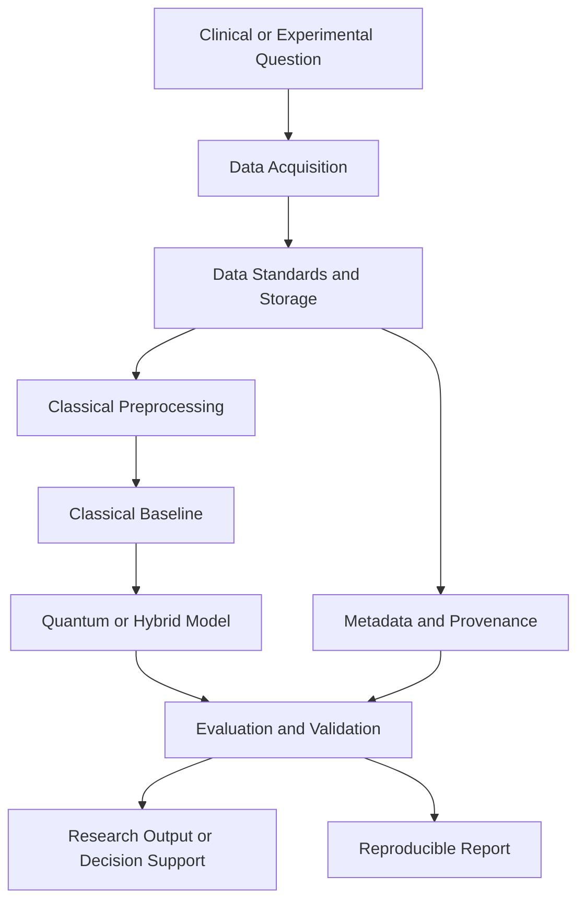

# Quantum Medical Engineering

Quantum medical engineering brings together quantum computing, machine learning, medical imaging, neuroscience, biomedical instrumentation, and scientific data engineering. This guide provides a starting point for exploring the field, selecting tools, and designing reproducible research workflows.

> Quantum methods are an emerging research area in medicine. They should be evaluated against strong classical baselines and used with appropriate clinical, privacy, and regulatory oversight.

## Contents

- [Research directions](#research-directions)
- [Reference architecture](#reference-architecture)
- [Data and informatics](#data-and-informatics)
- [Computational platforms](#computational-platforms)
- [Specialized medical software](#specialized-medical-software)
- [Quantum machine learning workflow](#quantum-machine-learning-workflow)
- [Engineering considerations](#engineering-considerations)
- [Learning path](#learning-path)
- [Source notes](#source-notes)

## Research Directions

### Quantum machine learning for medicine

Quantum machine learning (QML) applies quantum circuits or quantum-inspired methods to biomedical problems. Potential application areas include:

- Medical image classification and segmentation
- Molecular representation and drug discovery
- Patient risk stratification and outcome prediction
- Feature selection for high-dimensional biomedical datasets
- Optimization of treatment schedules or resource allocation
- Signal processing for neural, physiological, and wearable-device data

The practical question is not whether a model is quantum, but whether it improves a clinically meaningful metric, fits the available hardware and data constraints, and remains reproducible and interpretable.

### Neuroinformatics

Neuroinformatics combines neuroscience, data management, computation, and visualization. It supports the collection, organization, analysis, and sharing of data from neuroimaging, electrophysiology, behavioral experiments, and brain-computer interfaces.

### Medical imaging and visualization

Medical imaging engineering covers structural MRI, functional MRI, PET, CT, microscopy, and related modalities. Typical tasks include registration, denoising, segmentation, statistical mapping, surface analysis, visualization, and quantitative measurement.

### Biomedical and pharmaceutical engineering

Quantum and classical computational methods can support molecular simulation, chemical informatics, pharmaceutical discovery, biomarker development, and the analysis of experimental data. These applications require careful validation because small datasets, measurement bias, and data leakage can produce misleading results.

## Reference Architecture

A practical quantum medical engineering system can be organized into six layers:

### Layer responsibilities

| Layer | Responsibility | Typical outputs |
| --- | --- | --- |
| Research question | Define the clinical, biological, or engineering objective | Target variable, cohort definition, success criteria |
| Data acquisition | Collect imaging, signals, records, or experimental measurements | Raw data and acquisition metadata |
| Data standards | Normalize formats, identifiers, units, and provenance | Analysis-ready datasets |
| Classical preprocessing | Clean, register, segment, encode, and reduce data | Features or tensors |
| Modeling | Compare classical, quantum-inspired, and hybrid approaches | Trained models and predictions |
| Validation | Measure performance, robustness, bias, and resource cost | Metrics, uncertainty, error analysis |
| Delivery | Communicate results for research or decision support | Report, visualization, or validated prototype |

## Data and Informatics

### Core resources

| Area | Resource | Use |
| --- | --- | --- |
| Brain research | [BRAIN Initiative](https://braininitiative.nih.gov/) | Programs, research priorities, and neuroinformatics context. |
| Data acquisition | [Data Acquisition Notes](https://github.com/ophelialabs/ophelialabs.github.io/blob/main/pages/quantum/README2.md) | Related acquisition and quantum research references. |
| Data pipelines | [ESnet/DELERIA](https://newscenter.lbl.gov/2025/05/19/building-a-data-pipeline-to-accelerate-discovery/) | Research data-pipeline work supporting scientific discovery. |
| Open neuroimaging tools | [NITRC](https://www.nitrc.org/) | Neuroimaging tools, resources, and research projects. |
| Cloud neurodata | [AWS DANDI](https://dandiarchive.org/) | Cloud-accessible neurophysiology datasets and analysis resources. |
| Data archives | [DABI](https://dabi.temple.edu/) | Biomedical imaging and informatics research resource. |

### Data lifecycle

1. Define the research question, population, modality, and intended use.
2. Record consent, provenance, acquisition settings, and data governance requirements.
3. Store raw data separately from derived data and preserve immutable source copies.
4. Standardize identifiers, units, metadata, and file formats before modeling.
5. Split data by subject or study before fitting preprocessing or machine-learning pipelines.
6. Track code, parameters, model versions, random seeds, and hardware configuration.
7. Publish summary results with limitations, uncertainty, and reproducibility information.

## Computational Platforms

### Comprehensive platforms

| Platform | Primary role | Key capabilities |
| --- | --- | --- |
| [Neurodesk](https://neurodesk.org/) | Reproducible neuroimaging environment | Containerized software, browser-accessible desktop, and command-line workflows. |
| [BrainForge](https://brainforge.rs.gsu.edu/) | Neuroimaging data platform | Web-based archiving, processing, and sharing with tools such as Nipype and FreeSurfer. |
| [Neuroconductor](https://neuroconductor.org/) | R-based neuroimaging ecosystem | Open-source R packages and workflows modeled after Bioconductor. |
| [BrainStat](https://brainstat.readthedocs.io/en/master/) | Statistical neuroimaging | Python and MATLAB tools for surface and volumetric statistical analysis. |

### Supporting computing resources

| Resource | Role |
| --- | --- |
| [Python](https://www.python.org/) | General scientific computing and machine learning. |
| [MATLAB](https://www.mathworks.com/products/matlab.html) | Numerical computing and established imaging workflows. |
| [Jupyter](https://jupyter.org/) | Interactive analysis, documentation, and reproducible experiments. |
| [Dask](https://www.dask.org/) | Parallel and distributed processing for larger datasets. |
| [Bokeh](https://bokeh.org/) | Interactive scientific visualization. |
| [Coiled](https://www.coiled.io/) | Cloud execution for Dask workloads. |

## Specialized Medical Software

| Tool | Domain | Purpose |
| --- | --- | --- |
| [FreeSurfer](https://surfer.nmr.mgh.harvard.edu/) | Structural neuroimaging | Surface reconstruction, cortical measurements, and MRI analysis. |
| [SPM](https://www.fil.ion.ucl.ac.uk/spm/) | Functional neuroimaging | Statistical parametric mapping and fMRI analysis in MATLAB. |
| [Amira](https://www.thermofisher.com/us/en/home/electron-microscopy/products/software-em-3d-vis/amira-software.html) | 3D visualization | Visualization and analysis of scientific and biomedical imaging data. |
| [MIMneuro](https://www.mimsoftware.com/nuclear-medicine/mim-neuro) | Nuclear medicine | Review and analysis of neuroimaging examinations, including PET workflows. |
| [NITRC](https://www.nitrc.org/) | Tool discovery | Searchable catalog of neuroimaging applications and research resources. |

## Quantum Machine Learning Workflow

### 1. Frame the problem

Specify the clinical or biological question, prediction target, unit of analysis, acceptable error, and decision context. A research prototype should not be described as a diagnostic system unless it has undergone the required validation and review.

### 2. Establish a classical baseline

Start with a transparent baseline such as logistic regression, linear regression, a tree-based model, or a conventional neural network appropriate to the task. The baseline should use the same subject-level split, preprocessing rules, and evaluation metrics as the quantum approach.

### 3. Prepare the data

Medical datasets often contain missing values, class imbalance, repeated measurements, site effects, and correlated observations. Analyze these issues before modeling. For supervised learning, split by subject, patient, or study before fitting imputers, scalers, encoders, feature selectors, or dimensionality-reduction steps.

### 4. Reduce the representation

Current quantum hardware has limited qubits, noise, connectivity, and circuit depth. Use scientifically justified feature selection or dimensionality reduction, then document what information was retained or discarded. Avoid reducing data solely to make a quantum circuit fit if the transformation removes clinically meaningful signal.

### 5. Select a quantum or hybrid method

Candidate approaches include variational quantum classifiers, quantum kernels, quantum neural-network layers, quantum approximate optimization, and quantum-inspired optimization. Compare the method's data encoding cost, circuit depth, trainability, hardware availability, and expected benefit against classical alternatives.

### 6. Train and evaluate

Use fixed splits or carefully controlled cross-validation, report uncertainty intervals where practical, and evaluate more than accuracy. Depending on the use case, include sensitivity, specificity, precision, recall, F1 score, ROC-AUC, PR-AUC, calibration, subgroup performance, inference latency, and compute cost.

### 7. Perform error and bias analysis

Inspect false positives, false negatives, missing-data patterns, demographic or site-specific slices, and calibration. Document whether the model generalizes across institutions, instruments, acquisition protocols, and patient populations.

### 8. Record reproducibility metadata

Capture the dataset version, preprocessing pipeline, feature map, ansatz, optimizer, backend, noise model, seeds, circuit depth, shots, runtime, and software versions. A quantum result without this context is difficult to reproduce or compare.

## Engineering Considerations

### Privacy and governance

- Remove or protect direct identifiers and quasi-identifiers.
- Define access controls for raw, derived, and exported data.
- Record consent and permitted secondary uses.
- Apply institutional review, data-use agreements, and applicable regulations.
- Treat model outputs as research artifacts until clinical validation is complete.

### Reproducibility

- Keep raw data immutable and version derived datasets.
- Use containers or environment lockfiles for analysis dependencies.
- Separate exploratory notebooks from production pipelines.
- Automate quality checks and retain run metadata.
- Publish baseline comparisons and negative results where appropriate.

### Hardware strategy

| Constraint | Engineering response |
| --- | --- |
| Limited qubit count | Reduce or encode features carefully and report the transformation. |
| Noise and decoherence | Use noise-aware experiments, error mitigation, and realistic simulators. |
| Circuit depth | Prefer shallow, trainable circuits and measure execution cost. |
| Data-loading overhead | Compare the cost of encoding data with the expected modeling benefit. |
| Limited reproducibility | Pin backend, transpilation, seeds, shots, and software versions. |

## Learning Path

1. Learn linear algebra, probability, optimization, and basic quantum mechanics.
2. Build a classical medical-imaging or biomedical machine-learning baseline.
3. Study quantum circuits, measurement, gates, noise, and variational algorithms.
4. Reproduce a small QML medical example with a simulator.
5. Compare the quantum or hybrid method with the classical baseline under identical splits.
6. Add neuroinformatics or imaging tools such as FreeSurfer, SPM, Neurodesk, or BrainStat.
7. Move to hardware experiments only after the simulation workflow is reproducible.
8. Document limitations, data governance, and the path to external validation.

## Source Notes

The original reference list is preserved in [informatics.md](informatics.md), including:

- [Quantum machine learning for medical applications](https://www.youtube.com/watch?v=tqVgZ8Av6BE)
- [ChemicalQDevice](https://github.com/kevinkawchak/LLMs-Pharmaceutical/tree/main)
- [ChemicalQDevice YouTube channel](https://www.youtube.com/@chemicalqdevice)
- [Brain Initiative](https://braininitiative.nih.gov/)
- [AWS DANDI](https://dandiarchive.org/)
- [ESnet/DELERIA](https://newscenter.lbl.gov/2025/05/19/building-a-data-pipeline-to-accelerate-discovery/)
