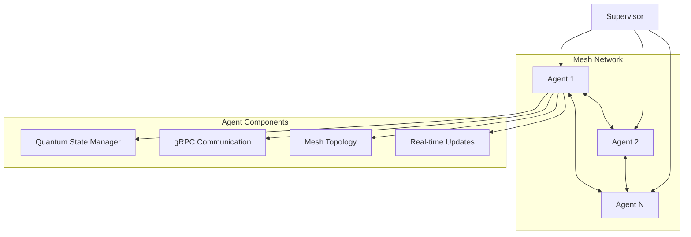

# NASA & Space Technology Resources

A comprehensive collection of projects, organizations, research materials, and educational resources related to NASA, space exploration, and advanced aerospace technologies.

- [Nasa](https://www.nasa.gov/)
| [Code](https://code.nasa.gov/)
| [Distributed Active Archive Centers (DAACs)](https://www.earthdata.nasa.gov/centers)
| [Vertex](https://search.asf.alaska.edu/#/)
| [Satellite Data Explorer](https://csdap.earthdata.nasa.gov/)
| [Dryad](https://datadryad.org/about#our-partners)
| [Dataverse](https://dataverse.org/installations) 

## Mission Eng
- [GMAT](https://documentation.help/GMAT/documentation.pdf) | [SMAD](https://smad.comm/mission-engineering/) | [Space-Track](https://www.space-track.org/documentation) | [live space telescope]() 

## IRIS
- [IRISpy](https://github.com/LM-SAL/irispy) | [LMSAL](https://lmsal.com/) | [NSTX‑U](https://www.pppl.gov/nstx-u)

---

## NASA & Space Technology {#nasa}

Official NASA tools, missions, and data platforms for space exploration and earth observation.

### Mission Tools & Platforms
- [JWST - James Webb Space Telescope](https://jwst-docs.stsci.edu/jwst-observatory-hardware/jwst-target-observability-and-observatory-coordinate-system#gsc.tab=0) - Observer hardware documentation and target observability information.
- [JIST - JWST Instrument Status Tool](https://jist.stsci.edu/jist) - Real-time monitoring of JWST instrument status and performance.
- [APT - Astronomers Proposal Tool](https://www.stsci.edu/scientific-community/software/astronomers-proposal-tool-apt) - Proposal submission and observation planning tool.
- [Roman Research Nexus](https://roman-docs.stsci.edu/data-handbook-home/roman-research-nexus) - Data portal and research resources for Roman Space Telescope.
- [Exposure Time Calculator](https://www.stsci.edu/jwst/science-planning/proposal-planning-toolbox/exposure-time-calculator) - Calculate exposure times for JWST observations.

### NASA Data Platforms
- [Earthdata - NASA Earth Data](https://earthdata.nasa.gov) - Comprehensive earth observation data and services from NASA.
- [NASA ACT - Advanced Computing & Technology](https://esto.nasa.gov/act/) - Advanced computing initiatives at NASA.
- [NASA OPERA - SAR & Optical Analysis](https://www.jpl.nasa.gov/go/opera/products/) - Operational Synthetic Aperture Radar and optical products.
- [NASA Quantum Initiative](https://esto.nasa.gov/quantum/) - NASA's quantum computing and quantum sensing programs.
- [Van Allen Belts Research](https://science.nasa.gov/biological-physical/stories/van-allen-belts/) - NASA science story on Earth's protective radiation belts.
- [CCMC - NASA Models & Modeling Center](https://ccmc.gsfc.nasa.gov/models/?services=Runs-on-Request&statuses=Production&statuses=Result+Only) - Community Coordinated Modeling Center with scientific models.

---

## Visualization & Monitoring Tools {#visualization}

Tools for data visualization and real-time monitoring.

- [Bokeh - Interactive Visualizations](https://bokeh.org/) - Python library for creating interactive visualizations.
- [Elastic Data Integrations](https://www.elastic.co/integrations/data-integrations) - Data integration and visualization with Elastic.
- [Grafana - Monitoring Dashboard](http://localhost:3000/connections/add-new-connection) - Add new connections for real-time monitoring.
- [Cesium for Unreal](https://cesium.com/platform/cesium-for-unreal/) - 3D geospatial visualization for Unreal Engine.
- [Algorithm Visualizer](https://algorithm-visualizer.org/) - Interactive tool to visualize and understand algorithms.

---

## Cloud & Big Data Platforms {#cloud-big-data}

Tools for big data processing, distributed computing, and data analysis.

### Distributed Computing
- [Dask - Parallel Computing](https://www.dask.org/) - Flexible parallel computing library for analytics.
- [Coiled - Scale Dask to the Cloud](https://docs.coiled.io/blog/processing-terabyte-scale-nasa-cloud-datasets-with-coiled.html) - Processing terabyte-scale NASA cloud datasets with Coiled.

### Cloud Computing
- [Google Earth Engine](https://console.cloud.google.com/apis/library/earthengine.googleapis.com?supportedpurview=project) - Geospatial analysis platform with massive datasets.
- [Google Cloud BigQuery](https://console.cloud.google.com/apis/library/) - Enterprise data warehouse with SQL analytics.
- [Azure Maps Code Samples](https://github.com/Azure-Samples/AzureMapsCodeSamples/tree/main) - Microsoft Azure mapping and spatial services.
- [OCI Big Data Services](https://docs.oracle.com/en/middleware/goldengate/big-data/23/gadbd/overview-articles.html) - Oracle Cloud Infrastructure big data platform.

### Database
- [Spring Data Cassandra](https://spring.io/projects/spring-data-cassandra) - Java framework for Apache Cassandra data access.

---

### Satellite Projects
- [UNH Student-Built Satellite for NASA IMAP](https://www.unh.edu/unhtoday/news/release/2025/11/06/unh-student-built-satellite-will-blast-space-collects-data-nasas-imap) - University of New Hampshire satellite project

---

# ReactNet

A distributed quantum mesh network implementation with gRPC communication.

## Architecture Overview



## Quick Start

1. Install dependencies
```bash
npm install @grpc/grpc-js @grpc/proto-loader
```

2. Create a mesh network with two agents:
```javascript
const agent1 = new MeshAgent('agent1', 35.0456, -85.3097);
const agent2 = new MeshAgent('agent2', 35.9606, -83.9207);

await agent1.joinMesh();
await agent2.joinMesh();
```

3. Example quantum state transfer
```javascript
await agent1.sendQuantumState('agent2', {
    fidelity: 0.98,
    qubitCount: 10
});
```

## Features

- Bi-directional gRPC communication
- Dynamic mesh network topology
- Quantum state transfer between agents
- Supervisor coordination of the mesh network
- Real-time status updates through the mesh

## Data Format

The system uses HDF5 as its data format, which is the standard format used in various missions including:
- Orbiting Carbon Observatory 2 (OCO-2)
- Joint Polar Satellite System (JPSS)

## System Stack Example

- **Linux container** → Cockpit → Podman → Hyrax

Learn more about HDF5 standards: [NASA Earthdata HDF5 Standards](https://www.earthdata.nasa.gov/about/esdis/esco/standards-practices/hdf5)

---

## Quantum Computing & Algorithms {#quantum}

Quantum computing platforms, benchmarking, and quantum algorithms.

- [DARPA QBI - Quantum Benchmarking Initiative](https://www.darpa.mil/research/programs/quantum-benchmarking-initiative) - DARPA's quantum computing benchmarking research program.

### Research & Publications
- [Grover's Algorithm - Azure Quantum](https://learn.microsoft.com/en-us/azure/quantum/concepts-grovers) - Learn about Grover's quantum search algorithm.
- [Advances and perspectives in fiber-based electronic devices for next-generation soft systems](https://www.nature.com/articles/s41528-025-00465-w#Sec10)
- [Capacitive Soft Strain sensors via Multicore-Shell Fiber Printing](https://advanced.onlinelibrary.wiley.com/doi/10.1002/adma.201500072)
- [Quantum Dot Lithium Niobate Integration](https://www.nature.com/articles/s41563-025-02398-1) - Advanced quantum photonic circuits for quantum networking.

### Quantum & Photonics
- [Tigercub](https://github.com/candacedo/tigercub-pq) - Quantum computing project on GitHub
- [kcqlab/satllazero](https://github.com/kcglab/satllazero) - Satellite communication research
- [AI-Based Optimization of Co-Designed Stacked Metallized Substrate Module Structures](https://www.researchgate.net/publication/395988294_AI-Based_Optimization_of_Co-Designed_Stacked_Metallized_Substrate_Module_Structures) - ResearchGate

### Quantum Physics
- [Quantum Mechanics Fundamentals](https://web1.eng.famu.fsu.edu/~dommelen/quantum/pdf/index.pdf) - Introduction to quantum mechanics principles and theory.

### General Scientific Research
- [PNAS (Proceedings of the National Academy of Sciences)](https://www.pnas.org/) - Premier multidisciplinary research journal